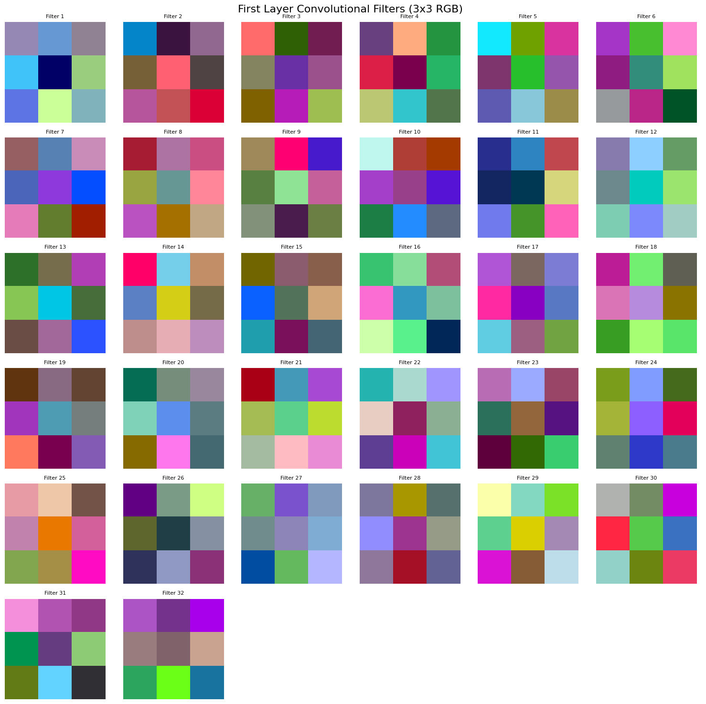
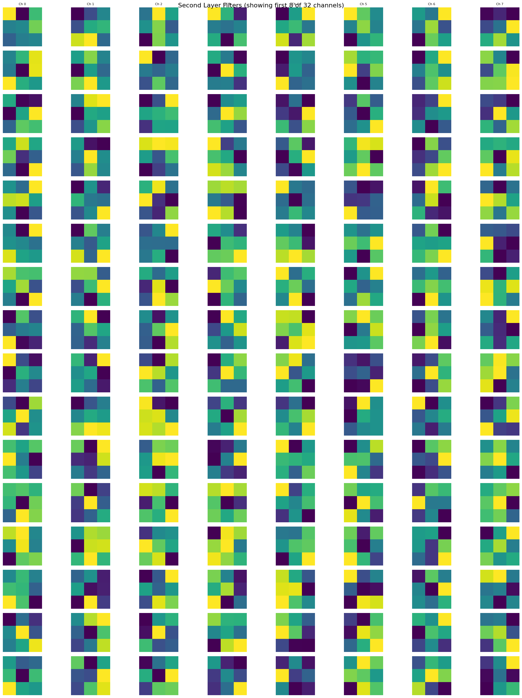
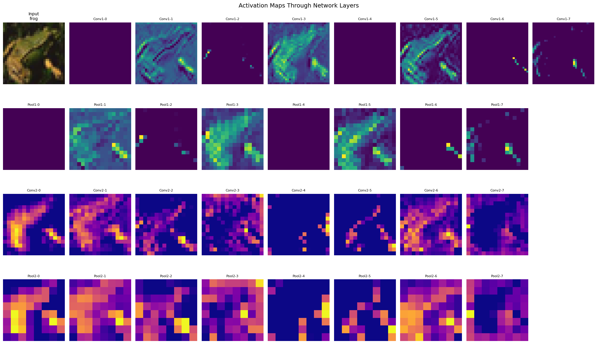

# CNN From Scratch - CIFAR-10 Image Classification


[](https://colab.research.google.com/)


A comprehensive implementation of a Convolutional Neural Network (CNN) built entirely from scratch using NumPy for image classification on the CIFAR-10 dataset. This project demonstrates deep understanding of CNN architectures, convolution operations, pooling mechanisms, and backpropagation through convolutional layers.

## 📋 Table of Contents
- [Overview](#-overview)
- [Features](#-features)
- [Dataset](#-dataset)
- [Model Architecture](#-model-architecture)
- [Technical Implementation](#-technical-implementation)
- [Usage](#-usage)
- [Results](#-results)
- [Visualizations](#-visualizations)
- [Key Insights](#-key-insights)
- [Challenges](#-challenges)
- [Contributing](#-contributing)
- [Future Enhancements](#-future-enhancements)
- [Author](#-author)

## 🎯 Overview

This project takes neural network implementation to the next level by building a Convolutional Neural Network completely from scratch using only NumPy. Unlike traditional fully connected networks, CNNs preserve spatial relationships in images through specialized operations like convolution and pooling, making them highly effective for image classification tasks.

**Educational Goals:**
- Understand the mathematics behind convolutional operations
- Implement im2col transformation for efficient convolution
- Master backpropagation through convolutional and pooling layers
- Learn spatial feature extraction and hierarchical representation
- Compare manual CNN implementation complexity with modern frameworks

**What Makes This Special:**
- ✅ Complete CNN implementation without any deep learning libraries
- ✅ Custom convolution using im2col for matrix multiplication efficiency
- ✅ Manual backpropagation through all CNN layers
- ✅ Visualization of learned filters and activation maps
- ✅ Understanding of how CNNs "see" and process images

## ✨ Features

**NumPy CNN Implementation**
- **Convolutional Layers**
  - Custom im2col transformation for efficient convolution
  - Same padding support for dimension preservation
  - He initialization for ReLU compatibility
  - Manual gradient computation through convolution
- **Pooling Layers**
  - Max pooling with 2×2 windows
  - Index tracking for backpropagation
  - Spatial dimension reduction
- **Activation Functions**
  - ReLU for hidden layers
  - Softmax for output layer
  - Numerically stable implementations
- **Dense Layers**
  - Fully connected layers after CNN feature extraction
  - He initialization
  - Efficient matrix operations
- **Training Features**
  - Mini-batch gradient descent
  - Data shuffling per epoch
  - Train/validation split
  - Loss and accuracy tracking
 
**Visualization Tools**
- **Learned Filter Visualization:** See what patterns each filter detects
- **Activation Maps:** Understand how the network processes images
- **Layer-by-layer Analysis:** Visualize feature extraction at each level
- **Training Curves:** Monitor loss and accuracy progression

## 📊 Dataset
**CIFAR-10 (Canadian Institute For Advanced Research)**

[CIFAR-10](https://www.kaggle.com/c/cifar-10) is a widely-used benchmark dataset for image classification research, containing 60,000 32×32 color images across 10 classes.
- Training Samples: 40,000 (after split)
- Validation Samples: 10,000
- Test Samples: 10,000
- Image Dimensions: 32×32×3 (RGB color images)
- Classes: 10 (airplane, automobile, bird, cat, deer, dog, frog, horse, ship, truck)
- Preprocessing: Normalized to [0, 1] range
- Format: (Batch, Channels, Height, Width) - PyTorch convention

### **Sample Images**


*Sample images from the CIFAR-10 dataset across all 10 classes*

## 🗂️ Model Architecture

### Network Structure

```
Input:              32×32×3 RGB Image
                         ↓
Conv Layer 1:       32 filters (3×3×3), ReLU, Same Padding
                    Output: 32×32×32
                         ↓
Max Pooling 1:      2×2 window, stride 2
                    Output: 16×16×32
                         ↓
Conv Layer 2:       64 filters (3×3×32), ReLU, Same Padding
                    Output: 16×16×64
                         ↓
Max Pooling 2:      2×2 window, stride 2
                    Output: 8×8×64
                         ↓
Flatten:            4,096 neurons (8×8×64)
                         ↓
Dense Layer 1:      128 neurons, ReLU
                         ↓
Dense Layer 2:      10 neurons, Softmax
                         ↓
Output:             10 class probabilities
```

### Architecture Details

| Layer   | Input Shape     | Output Shape    | Parameters | Operation                         |
| ------- | --------------- | --------------- | ---------- | ---------                         |
| Input   | (B, 3, 32, 32)  | (B, 3, 32, 32)  | 0          | -                                 |
| Conv1   | (B, 3, 32, 32)  | (B, 32, 32, 32) | 896        | 32 filters × (3×3×3) + 32 biases  |
| ReLU1   | (B, 32, 32, 32) | (B, 32, 32, 32) | 0          | Element-wise                      |
| Pool1   | (B, 32, 32, 32) | (B, 32, 16, 16) | 0          | Max pooling                       |
| Conv2   | (B, 32, 16, 16) | (B, 64, 16, 16) | 18,496     | 64 filters × (3×3×32) + 64 biases |
| ReLU2   | (B, 64, 16, 16) | (B, 64, 16, 16) | 0          | Element-wise                      |
| Pool2   | (B, 64, 16, 16) | (B, 64, 8, 8)   | 0          | Max pooling                       |
| Flatten | (B, 64, 8, 8)   | (B, 4096)       | 0          | Reshape                           |
| Dense1  | (B, 4096)       | (B, 128)        | 524,416    | 4096×128 + 128 biases             |
| ReLU3   | (B, 128)        | (B, 128)        | 0          | Element-wise                      |
| Dense2  | (B, 128)        | (B, 10)         | 1,290      | 128×10 + 10 biases                |
| Softmax | (B, 10)         | (B, 10)         | 0          | Probability distribution          |

### Total Parameters: 545,098

### Mathematical Components 

**1. Convolution Operation (via im2col)** <br>
**Forward Pass:**
 ```
  1. Transform image patches to columns: im2col(input) → (patch_size, num_patches)
  2. Flatten filters: kernels → (num_filters, patch_size)
  3. Matrix multiply: output = filters @ im2col_input
  4. Add biases and reshape to spatial format
 ```
**Why im2col?**
- Converts convolution into efficient matrix multiplication
- Leverages optimized BLAS operations
- 10-100× faster than nested loops

**2. Max Pooling** <br>
**Forward Pass:**
```
For each 2×2 window:
  output[i,j] = max(window)
  save argmax indices for backprop
```
**Backward Pass:**
```
Gradient flows only to max positions:
  gradient[max_position] = upstream_gradient
  gradient[other_positions] = 0
```
**Backpropagation Flow:**
```
Loss → Softmax/CE Gradient → Dense2 Backward → Dense1 Backward →
Unflatten → Pool2 Backward → ReLU2 Backward → Conv2 Backward →
Pool1 Backward → ReLU1 Backward → Conv1 Backward
```

**Key Equations**
- **Softmax + Cross-Entropy:** dL/dlogits = predictions - true_labels (simplified form)
- **ReLU Derivative:** dReLU(x)/dx = 1 if x > 0, else 0
- **Conv Gradient w.r.t. kernels:** Correlation of input with gradient
- **Conv Gradient w.r.t. input:** Transposed convolution

**Hyperparameters**
| Parameter     | Value             | Justification                         |
| ------------- | ----------------- | ------------------------------------- | 
| Learning Rate | 0,01              | Balanced between speed and stability  |
| Batch Size    | 64                | Efficient GPU utilization             |
| Epochs        | 5                 | Limited by Colab runtime constraints  |
| Filter Size   | 3x3               | Standard for capturing local patterns |
| Pooling Size  | 2x2               | Halves spatial dimensions             |
| Padding       | Same              | Preserves spatial dimensions          |
| Weight Init   | He Initialization | Optimized for ReLU activation         |

## 🔧 Technical Implementation

### Core Components

**1. im2col Transformation** <br>
Converts image patches into columns for efficient convolution:
```
Input:  (B, C, H, W) image
        (F, C, k_h, k_w) kernels

Process:
1. Extract all k_h × k_w patches
2. Flatten each patch across channels
3. Stack as columns

Output: (B, C×k_h×k_w, num_patches)
```
**Dimensions Example**
- Input: (64, 3, 32, 32)
- Kernel: 3×3
- im2col output: (64, 27, 1024)
- After convolution: (64, 32, 32, 32)

**2. Convolutional Backward Pass** <br>
Most complex component - computes three gradients:
```
1. Gradient w.r.t. Kernels:
   - Correlate input regions with output gradients
   - Shape: (num_filters, C_in, k_h, k_w)

2. Gradient w.r.t. Biases:
   - Sum output gradients across batch and spatial dims
   - Shape: (num_filters,)

3. Gradient w.r.t. Input:
   - "Spread" gradients through transposed convolution
   - Shape: (B, C_in, H_in, W_in)
```

**3. Memory-Efficient Training** <br>
**Challenges**
- CIFAR-10: 40,000 images × 3,072 pixels = 122MB+ in memory
- Forward pass caches: Additional ~500MB
- Solution: Mini-batch processing (64 samples at a time)

## 💻 Usage

See the [full notebook](notebooks/CNN_From_Scratch.ipynb) for the complete analysis

## 📈 Results
### Training Performance
***Note: Due to Google Colab runtime limitations, full training on 40,000 samples was not completed. I plan on returning to this later on.***

## 🎨 Visualizations

### Learned Filters

#### First Convolutional Layer (Conv1)


*32 learned 3×3×3 filters from the first convolutional layer*

**What to Look For:**
- Edge detectors (vertical, horizontal, diagonal)
- Color blob detectors (red, green, blue patterns)
- Simple texture patterns
- Combination of basic features

**Interpretation:** Even with limited training, filters show emergence of basic feature detectors. Fully trained filters would show clearer edge and color detection patterns.

#### Second Convolutional Layer (Conv2)


*Sample of 64 learned 3×3×32 filters from the second convolutional layer (showing first 8 channels of 16 filters)*

**What to Look For:**
- More abstract patterns (combinations of first layer features)
- Harder to interpret visually
- Each filter combines 32 channels from previous layer

#### Activation Maps


*Activation maps through all layers for a frog image*

**Layer-by-Layer Analysis:**
1. Conv1 Activations: Basic edges and color blobs light up
2. Pool1 Output: Downsampled but preserves important features
3. Conv2 Activations: Higher-level features (curves, textures, patterns)
4. Pool2 Output: Compact representation ready for classification

***Key Insight: Even in an undertrained model, the network shows hierarchical feature extraction - early layers detect simple patterns, later layers combine them into complex representations.***

## 🔑 Key Insights

### CNN-Specific Learnings
1. Spatial Hierarchies
   - CNNs preserve spatial relationships unlike fully connected networks
   - Early layers detect simple features (edges, colors)
   - Later layers combine features into complex patterns
   - Pooling provides translation invariance
2. im2col Transformation
   - Brilliant technique to convert convolution → matrix multiplication
   - Trades memory for speed (duplicates data but enables vectorization)
   - 10-100× faster than naive nested loops
   - Standard in modern deep learning frameworks
3. Convolution Backward Pass
   - Most mathematically complex part of CNN
   - Requires computing 3 different gradients simultaneously
   - "Transposed convolution" for input gradients
   - Correlation operation for kernel gradients
4. Padding Strategies
   - Valid (no padding): Output shrinks with each layer
   - Same padding: Preserves spatial dimensions
   - Same padding allows deeper networks without dimension collapse
5. Max Pooling Mechanics
   - Reduces spatial dimensions (computational efficiency)
   - Forward pass: simple maximum operation
   - Backward pass: routing gradients only to max positions
   - Index tracking is critical for backpropagation
  
### Implementation Challenges Overcome
1. Dimension Tracking
   - Keeping track of tensor shapes through all operations
   - Especially tricky with padding and stride
   - Formula: output_size = (input_size - kernel_size + 2 * padding) / (stride + 1)
2. Memory Management
   - im2col creates large temporary matrices
   - Caching all intermediate values for backprop
   - Solution: Mini-batch processing to limit memory usage
3. Gradient Computation
   - Chain rule through multiple layer types
   - Different gradient formulas for each operation
   - Careful matrix dimension matching
4. Numerical Stability
   - Softmax overflow prevention (subtract max before exp)
   - Epsilon in log to prevent log(0)
   - Gradient clipping to prevent exploding gradients

### Practical Insights
- **He Initialization:** Critical for ReLU networks - prevents dying neurons
- **Batch Size:** Balance between gradient stability (larger) and memory (smaller)
- **Learning Rate:** Most important hyperparameter - too high causes divergence, too low causes slow convergence
- **Data Normalization:** [0,255] → [0,1] dramatically improves training, helps converge faster
- **Validation Set:** Essential for detecting overfitting early

## 🚧 Challenges

### Technical Challenges
1. Performance Bottleneck
   - Pure NumPy implementation is 100-1000× slower than PyTorch
   - Convolution backward pass has too many nested loops
   - Training 40K images takes hours vs minutes with PyTorch
   - Tried : Partial vectorization
2. Memory Constraints
   - Google Colab free tier: 12GB RAM limit
   - Forward pass caches can exceed memory with large batches
   - Tried Solution: Smaller batch sizes
3. Runtime Limitations
   - Colab disconnects after ~12 hours or 90 minutes idle
   - Full training interrupted multiple times because of time and memory limitations
   - Tried Solution: Smaller dataset for demonstration

### Conceptual Challenges
1. Backpropagation Through Convolution
   - Understanding "transposed convolution" for input gradients
   - Visualizing how gradients flow spatially
   - Implementing correlation for kernel gradients
2. Pooling Gradient Flow
   - Gradients only flow to max positions
   - Requires saving indices during forward pass
   - Understanding discrete nature of max operation
  
## 🤝 Contributing

###Contributions are welcome! Here are ways you can help:
- 🐛 Report bugs and issues
- 💡 Suggest optimizations for faster training
- 📖 Improve documentation and add more visualizations
- 🔧 Submit pull requests for new features
- 🎓 Share your learnings and insights

## 🚀 Future Enhancements

###High Priority (Core Functionality)
- [ ] Complete Training
  - [ ] Train on full 40,000 samples
  - [ ] Achieve target 70%+ test accuracy
  - [ ] Implement model checkpointing for long training sessions
  - [ ] Save/load trained weights
- [ ] PyTorch Comparison
  - [ ] Implement identical architecture in PyTorch
  - [ ] Compare training time, accuracy, and ease of implementation
  - [ ] Visualize learning curves side-by-side
  - [ ] Document 3-5× speedup with PyTorch
- [ ] Gradient Verification
  - [ ] Implement numerical gradient checking
  - [ ] Verify all backprop implementations
  - [ ] Add unit tests for each layer
- [ ] Performance Optimization
  - [ ] Vectorize convolution backward pass (eliminate inner loops)
  - [ ] Implement Numba JIT compilation for hot paths
  - [ ] Profile code and optimize bottlenecks
  - [ ] Target 5-10× speedup over current implementation

### Medium Priority (Enhanced Functionality)
- [ ] Data Augmentation
  - [ ] Random horizontal flips
  - [ ] Random crops and shifts
  - [ ] Color jittering
  - [ ] Rotation and scaling
  - [ ] Expected +5-10% accuracy improvement
- [ ] Advanced Architectures
  - [ ] Implement 3+ convolutional layers
  - [ ] Add batch normalization
  - [ ] Implement dropout for regularization
  - [ ] Experiment with different filter sizes (5×5, 1×1)
- [ ] Optimization Algorithms
 - [ ] SGD with momentum
 - [ ] Adam optimizer
 - [ ] RMSprop
 - [ ] Learning rate scheduling (step decay, cosine annealing)
- [ ] Extended Visualizations
  - [ ] Confusion matrix
  - [ ] Per-class accuracy analysis
  - [ ] Maximally activating images for each filter
  - [ ] Gradient flow visualization
  - [ ] Learning rate finder plot
  - [ ] Filter activation statistics
- [ ] Evaluation Metrics
  - [ ] Precision, recall, F1-score per class
  - [ ] ROC curves and AUC
  - [ ] Top-k accuracy
  - [ ] Calibration plots
        
### Low Priority (Nice to Have)
  - [ ] Advanced Features
  - [ ] Transfer learning capabilities
  - [ ] Multi-GPU support (for PyTorch version)
  - [ ] Mixed precision training
  - [ ] TensorBoard integration
- [ ] Additional Datasets
  - [ ] Fashion-MNIST (grayscale, easier)
  - [ ] SVHN (Street View House Numbers)
  - [ ] Custom dataset support
- [ ] Regularization Techniques
  - [ ] L1/L2 weight decay
  - [ ] Early stopping
  - [ ] Cutout/mixup augmentation
  - [ ] Label smoothing
- [ ] Architecture Experiments
  - [ ] Residual connections (ResNet-style)
  - [ ] Inception modules
  - [ ] Different pooling strategies (average, global)
  - [ ] Dilated convolutions
- [ ] Model Interpretation
  - [ ] Grad-CAM visualization
  - [ ] Occlusion sensitivity maps
  - [ ] Filter ablation studies
  - [ ] Feature map clustering

### Research & Advanced Topics
- [ ] Theory Deep Dive
  - [ ] Mathematical proof of gradient correctness
  - [ ] Convergence analysis
  - [ ] Receptive field calculations
  - [ ] Parameter count vs accuracy trade-offs
- [ ] Comparative Studies
  - [ ] Benchmark against classical ML (SVM, Random Forest)
  - [ ] Compare different initialization strategies
  - [ ] Ablation study on architecture choices
     
## 👤 Author

**Umut Bekdemir**

- GitHub: [@DoubleCyclone](https://github.com/DoubleCyclone)
- LinkedIn: [Umut Bekdemir](https://www.linkedin.com/in/umut-bekdemir-803a2825a)
- Email: [umut.bekdemir29@gmail.com](mailto:umut.bekdemir29@gmail.com)
